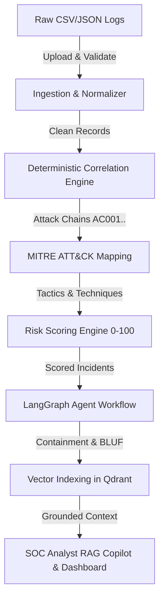

# 🛡️ ThreatIntel (Threat Intel) — Master Project Guide & Jury Q&A Prep

> **Team Name:** TimonTrack  
> **Track:** AI Track (BOB AI Hackathon)  
> **Team Members:** Abhi Kakadiya (Lead), Jaimin Parmar, Digisha Savaliya, Om Ghori  
> **Repository:** `bob-ai-hackathon-Timon`  
> **Live Web Application:** [bob-ai-hackathon-timon-puce.vercel.app](https://bob-ai-hackathon-timon-puce.vercel.app/)  
> **Backend API Docs:** `http://127.0.0.1:8000/docs` (Swagger / OpenAPI)

---

## 📑 Table of Contents
1. [30-Second Elevator Pitch (Memorize This)](#1-30-second-elevator-pitch-memorize-this)
2. [2-Minute Formal Project Pitch (For Presentation Opening)](#2-2-minute-formal-project-pitch)
3. [The Core Problem & Real-World Context](#3-the-core-problem--real-world-context)
4. [What We Built: ThreatIntel (Threat Intel)](#4-what-we-built-threatintel)
5. [System Architecture & Full Tech Stack](#5-system-architecture--full-tech-stack)
6. [The 7-Stage End-to-End Operational Pipeline](#6-the-7-stage-end-to-end-operational-pipeline)
7. [Mathematical & Algorithmic Deep Dive](#7-mathematical--algorithmic-deep-dive)
   - [Alert Correlation Engine (Deterministic, O(n))](#alert-correlation-engine)
   - [MITRE ATT&CK Mapping Engine](#mitre-attck-mapping-engine)
   - [Deterministic Risk Scoring Formula (0–100)](#deterministic-risk-scoring-formula)
   - [Why Deterministic Risk Scoring Instead of Pure LLM?](#why-deterministic-risk-scoring)
8. [LangGraph Multi-Agent Orchestration](#8-langgraph-multi-agent-orchestration)
9. [Vector Retrieval-Augmented Generation (Qdrant + FastEmbed)](#9-vector-rag-qdrant--fastembed)
10. [Multi-Tenancy & Enterprise Security Isolation](#10-multi-tenancy--enterprise-security-isolation)
11. [Frontend SOC Dashboard (12 Pages & UI Capabilities)](#11-frontend-soc-dashboard)
12. [Top 25 Jury Questions & Battle-Tested Answers](#12-top-25-jury-questions--battle-tested-answers)
13. [Key Cybersecurity Terms & Glossary](#13-key-cybersecurity-terms--glossary)
14. [Quick Reference Cheat Sheet (Numbers & Metrics)](#14-quick-reference-cheat-sheet)

---

## 1. 30-Second Elevator Pitch (Memorize This)

> *"Modern Security Operations Centers drown in over 10,000 fragmented alerts every day, causing extreme alert fatigue and buried cyber intrusions. **ThreatIntel** is an end-to-end autonomous threat intelligence platform that takes raw, noisy security logs, correlates them into chronological **Attack Chains**, automatically maps them to the **MITRE ATT&CK** framework, calculates a mathematical **0–100 Risk Score**, generates commander-ready **BLUF (Bottom Line Up Front)** executive briefs using **LangGraph** multi-agent AI, and gives tier-1 analysts an interactive **Qdrant-powered RAG Copilot** to investigate threats in seconds."*

---

## 2. 2-Minute Formal Project Pitch

> *"Respected Jury members,*
>
> *In cybersecurity, time is the adversary's greatest asset. Today, tier-1 SOC analysts waste up to 70% of their shifts triaging false positives and stitching together fragmented logs from firewalls, SIEMs, and endpoint telemetry. By the time a multi-stage intrusion is manually pieced together, data exfiltration has already happened.*
>
> *We built **ThreatIntel** (Threat Intel) to solve this exact bottleneck. Our platform features a multi-tiered pipeline:*
>
> 1. *First, a **high-throughput ingestion engine** normalizes raw, heterogeneous security logs.*
> 2. *Next, our **deterministic Alert Correlation Engine** groups isolated alerts into coherent, multi-stage **Attack Chains** using source IP affinity, 30-minute sliding time windows, and cyber kill-chain progression—instantly slashing alert noise by over 80%.*
> 3. *Each chain is automatically mapped to standard **MITRE ATT&CK enterprise techniques** such as Brute Force, Credential Dumping, and Command Execution.*
> 4. *We then calculate a transparent, **mathematical 0–100 Risk Score** based on event weights, MITRE tactical impact, and chain progression bonuses, categorizing threats into Low, Medium, High, and Critical.*
> 5. *Next, our **LangGraph multi-agent workflow** orchestrates specialized LLM agents powered by Llama 3.3 70B (and watsonx.ai foundation models) to autonomously draft executive **BLUF reports** and actionable 4-tier remediation playbooks.*
> 6. *Finally, all attack telemetry is embedded into a **Qdrant vector database**, powering an interactive **SOC Analyst Chat Copilot** that provides grounded, hallucination-free answers with cited Indicators of Compromise (IOCs).*
>
> *The entire system is production-grade, backed by PostgreSQL, two-tier Redis caching, full tenant data isolation, 106 automated tests, and a stunning dark-mode glassmorphic React dashboard."*

---

## 3. The Core Problem & Real-World Context

### Who Has This Problem?
- **Security Operations Center (SOC) Analysts (Tier 1 & Tier 2)**
- **Cyber Defense Incident Responders (CIRTs)**
- **Chief Information Security Officers (CISOs) & Military/Enterprise Commanders**

### Core Pain Points:
1. **Acute Alert Fatigue:** An enterprise receives 10,000 to 100,000 alerts daily. Over 80% are benign or redundant. Analysts suffer cognitive burnout and miss real threats.
2. **Schema Fragmentation:** SIEMs (Splunk, IBM QRadar), firewalls, and EDR sensors generate logs in incompatible formats. Correlating them manually across timestamps and IPs takes hours.
3. **Delayed Decision Cycles:** Non-technical executives and commanders need **BLUF (Bottom Line Up Front)** clarity: *What happened? Which assets are compromised? What is our immediate blast radius? What must we do right now?* Manual report generation takes hours; attackers move in minutes.
4. **Lack of Explainability in Black-Box AI:** Simply feeding raw alerts to an LLM leads to hallucinations, missing alerts, and non-reproducible risk scores.

---

## 4. What We Built: ThreatIntel

ThreatIntel is a production-ready, cloud-native threat intelligence correlation and prioritization platform.

| Capability | What It Does |
|---|---|
| **Multi-Source Ingestion** | Ingests security telemetry (CSV/JSON), parses, validates, and normalizes into canonical records. |
| **Alert Correlation Engine** | Groups fragmented alerts into end-to-end Attack Chains (`AC001`, `AC002`, etc.) using sliding time windows and IP heuristics. |
| **MITRE ATT&CK Mapping** | Automatically tags attack behaviors with standardized Enterprise MITRE technique IDs (e.g., `T1595`, `T1110`, `T1059`). |
| **Deterministic Risk Scoring** | Calculates an auditable, mathematical 0–100 risk score and assigns severity (`Low`, `Medium`, `High`, `Critical`). |
| **Autonomous AI Agents** | Uses LangGraph to coordinate executive BLUF report synthesis and tactical remediation playbooks. |
| **Interactive SOC Copilot** | FastEmbed + Qdrant vector database powering grounded RAG chat over live attack telemetry. |
| **Modern SOC Dashboard** | Dark-mode glassmorphic React 18 interface with interactive charts, MITRE matrix, and attack graphs. |

---

## 5. System Architecture & Full Tech Stack

```
[ Frontend: React 18 + Vite + Tailwind/Glassmorphism + Recharts ]
                          │  (HTTPS / REST / JWT)
                          ▼
[ API Gateway: FastAPI (Python 3.11) + Pydantic v2 validation ]
                          │
  ┌───────────────────────┼───────────────────────┐
  ▼                       ▼                       ▼
[ PostgreSQL / Neon ]  [ Upstash Redis ]   [ Qdrant Vector DB ]
(Relational storage    (L1/L2 Sub-10ms     (Dense 384-d vectors,
 & Tenant Data)         Tenant Caching)     Cosine Similarity)
                          │
                          ▼
[ LangGraph Stateful Agent Workflow Orchestrator ]
  ├── Node 1: Load Chain & Temporal Reconstruction
  ├── Node 2: MITRE ATT&CK Mapping Service
  ├── Node 3: Deterministic Risk Scoring Engine
  ├── Node 4: Recommendation Agent (Llama 3.3 70B / watsonx.ai)
  ├── Node 5: BLUF Report Agent (Executive Synthesis)
  └── Node 6: Store Results & Vector Embeddings
```

### Complete Technology Stack:
- **Backend:** FastAPI (Python 3.11), Uvicorn, SQLAlchemy ORM, Pydantic v2, Alembic.
- **Frontend:** React 18, Vite, Lucide Icons, Recharts, Framer Motion, Zustand (State Management), Vanilla CSS / Custom Design System.
- **AI & Orchestration:** LangGraph, LangChain, Groq Cloud (Llama 3.3 70B Versatile), watsonx.ai foundation models fallback.
- **Vector Database & Embeddings:** Qdrant (Cloud/In-Memory), FastEmbed (`BAAI/bge-small-en-v1.5`, 384-dimensional dense vectors).
- **Relational Database:** PostgreSQL (Neon Cloud) / SQLite (local fallback).
- **Caching Layer:** Upstash Redis (REST) + L1 local in-memory TTL cache with tenant-isolated keys.
- **DevOps & Testing:** Docker, GitHub Actions CI/CD, Pytest (106 unit & integration tests).

---

## 6. The 7-Stage End-to-End Operational Pipeline



1. **Upload & Schema Normalization:**
   - The operator uploads a CSV file containing security logs (`timestamp`, `src_ip`, `dst_ip`, `event`, `severity`).
   - The parser validates headers, strips whitespace, converts timestamps to UTC, removes invalid rows, and assigns the tenant `user_id`.
2. **Temporal Correlation:**
   - Alerts are grouped by adversary source IP (`src_ip`).
   - Within each IP bucket, events are partitioned into separate Attack Chains whenever the gap between events exceeds **30 minutes**.
   - Events are sorted according to cyber kill-chain progression stages.
3. **MITRE ATT&CK Mapping:**
   - Each event signature is matched against a curated MITRE knowledge dictionary (e.g., `PortScan` → `T1595 Active Scanning`, `BruteForce` → `T1110 Brute Force`, `Malware` → `T1204 User Execution`).
4. **Deterministic Risk Calculation:**
   - Sub-scores are computed for: Event severity + MITRE tactic impact + Chain length bonus.
   - The final score is clamped between 0 and 100, assigning `Critical`, `High`, `Medium`, or `Low`.
   - Explainability reasoning strings are automatically compiled.
5. **AI Report & Recommendation Generation:**
   - LangGraph invokes the **Recommendation Agent** to output 4 structured playbooks (Immediate, Containment, Investigation, Prevention).
   - LangGraph invokes the **BLUF Report Agent** to formulate a sub-100-word executive summary with business impact and threat levels.
6. **Vector Knowledge Synchronization:**
   - Incident narratives, tactical profiles, and risk scores are embedded via FastEmbed (`bge-small-en-v1.5`) and synced to Qdrant.
7. **Interactive SOC Copilot:**
   - Tier-1 analysts query the system in natural language (*"What is the blast radius of AC001?"* or *"Show all chains involving credential dumping"*).
   - LangGraph runs semantic similarity search against Qdrant, merges conversational history, and generates grounded answers citing specific IPs and MITRE IDs.

---

## 7. Mathematical & Algorithmic Deep Dive

### Alert Correlation Engine
- **Time Complexity:** $O(n \log n)$ due to initial timestamp sorting, followed by $O(n)$ hash grouping by `src_ip`.
- **Time Window Threshold:** Default `30 minutes` (`DEFAULT_TIME_WINDOW_MINUTES = 30`). If an attacker pauses for >30 minutes from the same IP, a new attack chain is instantiated.
- **Stage Ordering:** Events within a chain are sorted by cyber kill-chain progression:
  1. Reconnaissance / PortScan
  2. Enumeration / Network Service Discovery
  3. BruteForce / CredentialDumping
  4. PrivilegeEscalation / UnauthorizedAccess
  5. LateralMovement / C2Beacon
  6. CommandExecution / RemoteCodeExecution
  7. Malware / MalwareDownload
  8. DataExfiltration / Impact

### MITRE ATT&CK Mapping Engine
- Uses an extensible deterministic dictionary mapping event names to enterprise technique IDs:
  - `PortScan` / `Reconnaissance` $\rightarrow$ `T1595` (Active Scanning / Reconnaissance)
  - `Enumeration` $\rightarrow$ `T1046` (Network Service Discovery / Discovery)
  - `BruteForce` $\rightarrow$ `T1110` (Brute Force / Credential Access)
  - `CredentialDumping` $\rightarrow$ `T1003` (OS Credential Dumping / Credential Access)
  - `CommandExecution` / `RemoteCodeExecution` $\rightarrow$ `T1059` (Command & Scripting / Execution)
  - `PrivilegeEscalation` $\rightarrow$ `T1068` (Exploitation for Privilege Escalation)
  - `DataExfiltration` $\rightarrow$ `T1041` (Exfiltration Over C2 Channel / Exfiltration)
  - `Malware` $\rightarrow$ `T1204` (User Execution / Execution)

### Deterministic Risk Scoring Formula
The overall risk score is calculated as:

$$\text{RawScore} = \text{EventScore} + \text{MitreScore} + \text{ChainBonus}$$

$$\text{FinalScore} = \min(100, \max(0, \text{RawScore}))$$

#### 1. Event Sub-Score ($\text{EventScore}$)
Calculated from unique observed event types:
- `DataExfiltration`: 70 pts
- `Ransomware`: 60 pts
- `Malware`: 50 pts
- `PrivilegeEscalation`: 45 pts
- `LateralMovement`: 40 pts
- `CredentialDumping`: 40 pts
- `CommandExecution`: 35 pts
- `C2Beacon`: 35 pts
- `SQLInjection`: 30 pts
- `BruteForce`: 25 pts
- `DDoS`: 25 pts
- `Phishing`: 20 pts
- `PortScan` / Default: 10 pts

#### 2. MITRE Tactic Sub-Score ($\text{MitreScore}$)
Deduplicated by unique tactic to prevent artificial inflation:
- `Exfiltration`: 30 pts
- `Impact`: 25 pts
- `Credential Access`: 20 pts
- `Privilege Escalation`: 20 pts
- `Lateral Movement`: 20 pts
- `Execution`: 15 pts
- `Persistence`: 15 pts
- `Defense Evasion`: 15 pts
- `Command and Control`: 15 pts
- `Initial Access`: 10 pts
- `Reconnaissance`: 5 pts

#### 3. Chain Progression Bonus ($\text{ChainBonus}$)
Reflects multi-stage kill-chain maturity:
- **$\ge 7$ events:** $+20$ points (Full advanced persistent threat progression)
- **$\ge 5$ events:** $+15$ points
- **$\ge 3$ events:** $+10$ points
- **$< 3$ events:** $0$ points

#### Severity Tier Classification
- **Critical:** $76 - 100$
- **High:** $51 - 75$
- **Medium:** $26 - 50$
- **Low:** $0 - 25$

### Why Deterministic Risk Scoring Instead of Pure LLM?
*(CRITICAL JURY QUESTION)*
1. **Mathematical Reproducibility & Auditability:** Defense regulations (NIST, ISO 27001) require risk scores to be identical when re-evaluated on identical telemetry. LLMs have non-zero temperature variance.
2. **Zero Hallucination in Risk Prioritization:** An LLM might hallucinate severity due to scary phrasing in a payload. Our formula only evaluates proven, verified telemetry factors.
3. **Speed & Zero Token Overhead:** Scoring 100 attack chains takes <5 milliseconds via CPU mathematics, whereas running 100 LLM calls would take minutes and cost tokens.
4. **Where AI Actually Belongs:** We use AI where it excels—summarization, contextual synthesis, reasoning explanation, and human-like dialogue.

---

## 8. LangGraph Multi-Agent Orchestration

### Workflow Graph Structure
The automated pipeline is built using LangGraph's `StateGraph`:

```
START ──► load_chain ──(conditional)──► mitre_mapping ──(conditional)──► risk_scoring
                                                                             │
END   ◄── store_results ◄── bluf_report ◄── recommendations ◄──(conditional)─┘
```

### Conditional Edge & Short-Circuit Fail-Safe
- Every transition executes `should_continue(state)`.
- If an exception or database error occurs at any node, the state updates with `status = "failed"` and the router immediately bypasses downstream LLM calls, short-circuiting to `store_results` to record the exact failure timestamp and diagnostics.

### AI Agents Inside the Workflow:
1. **Recommendation Agent:**
   - Model: Llama 3.3 70B Versatile (Groq Cloud / watsonx.ai).
   - Enforces strict Pydantic parsing: `immediate_actions`, `containment_actions`, `investigation_actions`, `prevention_actions`, and `executive_summary`.
   - Configured with low temperature ($0.2$) to ensure actionable, standard cybersecurity procedures.
2. **BLUF Report Agent:**
   - Role: Senior Cyber Threat Intelligence Analyst.
   - Outputs: sub-100 word executive summary answering: *What happened? Why does it matter? What must be done?*
   - Cites confirmed source IPs, destination assets, and MITRE IDs.

---

## 9. Vector RAG (Qdrant + FastEmbed)

### Embedding Model:
- **`BAAI/bge-small-en-v1.5`** running through **FastEmbed**.
- Produces **384-dimensional** dense vectors.
- Runs locally in Python with ONNX runtime, generating embeddings in <15ms without sending raw text to third-party embedding APIs.

### Vector Storage & Indexing:
- **Engine:** Qdrant (supports both in-memory `:memory:` for local dev and cloud remote cluster).
- **Distance Metric:** Cosine Similarity.
- **Payload Indexing:** Indexed on `user_id`, `chain_id`, `risk`, and `mitre` for metadata-filtered semantic search.

### Grounded Analyst Chat Flow:
1. Analyst submits question: *"Which attack chains involve exfiltration to external IPs?"*
2. LangGraph `retrieve_node` embeds query via FastEmbed and queries Qdrant with tenant filter `user_id == current_user.id`.
3. Top-$k$ relevant attack chain narratives and risk scores are fetched.
4. LangGraph `answer_node` injects retrieved context and recent conversation memory into the prompt.
5. Llama 3.3 generates a grounded answer citing exact IPs, timestamps, and technique IDs.
6. LangGraph `memory_node` writes the conversational turn into PostgreSQL `chat_history`.

---

## 10. Multi-Tenancy & Enterprise Security Isolation

1. **Foreign Key Tenant Scoping:** All database entities (`uploads`, `alerts`, `attack_chains`, `chat_history`) feature a `user_id` foreign key referencing `users.id` with `ondelete="CASCADE"`.
2. **Composite Unique Indexing:** The `attack_chains` table uses a composite index `(user_id, chain_id)`. Tenant A and Tenant B can both have their own `AC001` without namespace collision.
3. **Repository-Level Query Enforcement:** Every database repository query strictly includes `.filter(Model.user_id == current_user.id)`. It is mathematically impossible for User A to read User B's alerts.
4. **Tenant-Isolated Two-Tier Caching:** Redis cache keys are formatted as `{prefix}_{user_id}` (e.g., `dashboard_stats_9b1deb4d...`). Purging or reading cache never leaks cross-tenant state.
5. **JWT Authentication:** Cryptographically signed tokens (HS256) with password hashing via `passlib[bcrypt]`.

---

## 11. Frontend SOC Dashboard

Built with **React 18 + Vite** featuring a dark-mode glassmorphic theme designed for high-stress SOC environments:

| Page | Functionality |
|---|---|
| **DashboardPage** | Live telemetry KPIs, severity breakdown donut chart, attack chain distribution, active threat feed. |
| **UploadPage** | Drag-and-drop CSV log uploader with client-side header validation, live parsing progress bar, and correlation trigger. |
| **AttackChainsPage** | Visual inventory of all reconstructed attack chains, source IPs, affected destination hosts, event sequences, and duration. |
| **IncidentDetailPage** | In-depth timeline of a single attack chain, showing each alert in kill-chain order with raw payloads and host metadata. |
| **MitrePage** | Interactive MITRE ATT&CK enterprise matrix heatmap displaying covered tactics and techniques with frequency counts. |
| **RiskPage** | Breakdown of deterministic risk scores (0–100), severity badges (`Critical`, `High`, `Medium`, `Low`), and transparent reasoning points. |
| **RecommendationsPage** | 4-tab actionable SOC containment guide (Immediate, Containment, Investigation, Prevention) with one-click copy. |
| **ReportsPage** | Executive BLUF summary card, threat assessment, conclusion, and one-click PDF & Markdown report export. |
| **ChatPage** | Interactive AI SOC Copilot with suggested prompt pills, conversation history, and cited IOCs. |
| **AnalyticsPage** | Comprehensive charts on threat progression, IP frequency distributions, and MITRE tactic prevalence. |
| **SettingsPage** | API key management, Groq/watsonx model selection, cache invalidation, and tenant profile configuration. |
| **Auth Pages** | Complete Login, Register, Forgot Password, and Reset Password workflows with token-based recovery. |

---

## 12. Top 25 Jury Questions & Battle-Tested Answers

### 🤖 Category 1: AI, LLMs & Agents

#### Q1: "Why didn't you just pass the raw security logs directly into ChatGPT or Llama 3?"
> **Answer:** *"Passing raw logs directly to an LLM suffers from three major flaws:  
> 1. **Context Window & Cost Exhaustion:** Feeding 10,000 logs exceeds token limits and costs significant money.  
> 2. **Hallucination of Threat Metrics:** An LLM might invent an IP address or assign arbitrary severity based on language rather than cyber risk formulas.  
> 3. **Non-Determinism:** The same log file could get a risk score of 80 today and 40 tomorrow.  
> We use a **hybrid architecture**: deterministic Python algorithms do the heavy lifting (log normalization, correlation, MITRE mapping, and mathematical risk calculation), while the LLM is reserved strictly for high-value tasks: executive summarization, action recommendations, and natural language copilot dialogue."*

#### Q2: "What is LangGraph and why did you use it over standard LangChain chains?"
> **Answer:** *"Standard LangChain chains execute linear pipelines. If step 3 fails, the entire pipeline crashes without recovery. **LangGraph** models our workflow as a stateful directed graph (`StateGraph`). It enables:  
> 1. Explicit shared state (`ThreatWorkflowState`) across all nodes.  
> 2. Conditional edge routing (`should_continue`), allowing graceful short-circuiting to record errors in the database without failing the entire request.  
> 3. State persistence and multi-turn conversational memory for our analyst chat copilot."*

#### Q3: "How do you prevent the LLM from hallucinating in the SOC Copilot?"
> **Answer:** *"We employ three strict guardrails:  
> 1. **Grounded RAG Retrieval:** The model receives only verified, structured context retrieved from Qdrant vector search and our PostgreSQL database.  
> 2. **Strict System Prompt Constraints:** The system prompt explicitly commands: *'Ground every statement in the provided attack chain context. Do NOT speculate or invent IP addresses or techniques. If the data is absent, state that it is unobserved.'*  
> 3. **Low Temperature Inference:** We set temperature to $0.2$, maximizing determinism and factual adherence."*

#### Q4: "What LLMs do you use, and how is IBM watsonx incorporated?"
> **Answer:** *"Our primary inference engine is **Llama 3.3 70B Versatile** hosted on Groq for ultra-low latency (<500ms responses), and we architected the system to interface with **watsonx.ai foundation models** (Granite / Llama) via standard LangChain integrations. If external cloud credentials are unavailable in an offline or air-gapped environment, the system gracefully falls back to local heuristic generation so the platform never crashes."*

---

### 🛡️ Category 2: Cybersecurity & Attack Correlation

#### Q5: "How does your correlation engine work, and how does it reduce false positives?"
> **Answer:** *"Our correlation engine groups alerts using a 3-step deterministic algorithm:  
> 1. **Source IP Affinity:** Alerts originating from the same adversary IP are bucketed together in $O(n)$ time.  
> 2. **30-Minute Sliding Temporal Window:** Events occurring within 30 minutes of each other are chained. If the attacker pauses for more than 30 minutes, a separate chain is created.  
> 3. **Kill-Chain Stage Progression:** Events are ordered from initial reconnaissance (port scans) to credential theft, privilege escalation, and exfiltration.  
> This eliminates false positive noise because an isolated ping or failed login remains a low-risk single-event chain, whereas a coordinated multi-stage intrusion is elevated and prioritized."*

#### Q6: "Can an attacker bypass your correlation by rotating IP addresses?"
> **Answer:** *"If an attacker uses rotating proxies or a distributed botnet, single-source IP correlation will group each IP separately. However, in our architecture, our MITRE mapper still identifies concurrent techniques across identical destination servers, and our Qdrant vector database indexes common temporal and payload signatures. For our next version, we have planned destination-subnet clustering and behavioral graph clustering using Graph Neural Networks (GNNs)."*

#### Q7: "What is MITRE ATT&CK and why is it essential for your platform?"
> **Answer:** *"MITRE ATT&CK is the globally recognized cybersecurity knowledge base of adversary tactics, techniques, and procedures (TTPs) based on real-world observations. Mapping alerts to MITRE provides a vendor-neutral common language. Instead of an analyst reading an obscure proprietary vendor log like 'Rule ID 4082', ThreatIntel translates it into `T1110 (Brute Force)` under the `Credential Access` tactic, instantly telling the team where the attacker is in their intrusion lifecycle."*

#### Q8: "Explain your risk scoring formula. How do you decide what is Critical vs Low?"
> **Answer:** *"Our formula is:  
> $$\text{Score} = \min(100, \text{EventScore} + \text{MitreScore} + \text{ChainBonus})$$  
> - **Event Score:** Weighs high-impact events heavily (e.g., Data Exfiltration = 70 pts, Malware = 50 pts, Port Scan = 10 pts).  
> - **MITRE Score:** Adds tactical impact (Exfiltration = 30 pts, Credential Access = 20 pts, Recon = 5 pts).  
> - **Chain Bonus:** Rewards progression depth (+20 pts for 7+ events, +10 pts for 3+ events).  
> Severity bands: 0–25 is Low, 26–50 is Medium, 51–75 is High, and 76–100 is Critical. Every score comes with generated human-readable explanations explaining why points were awarded."*

---

### 🏗️ Category 3: Architecture, Scalability & Databases

#### Q9: "Why did you choose Qdrant over Elasticsearch or Chroma?"
> **Answer:** *"Qdrant is written in Rust, offering exceptional memory efficiency and ultra-fast vector search. Crucially, Qdrant allows **payload-based metadata filtering** during vector search. We can filter by `user_id`, `risk_level`, or `mitre_tactic` at query time without sacrificing vector recall. Additionally, it supports an embedded in-memory mode (`:memory:`) which makes our automated test suite and local evaluation instantaneous without spinning up external cloud dependencies."*

#### Q10: "Why use FastEmbed instead of OpenAI embeddings?"
> **Answer:** *"FastEmbed runs locally using ONNX runtime and the `BAAI/bge-small-en-v1.5` model. This gives us three huge advantages:  
> 1. **Zero External API Latency:** Embeddings are generated in <15 milliseconds in-process.  
> 2. **Zero Cost & Privacy:** Threat intelligence logs contain sensitive internal IP addresses; FastEmbed processes vectors locally without leaking IP data to third-party APIs.  
> 3. **Compact 384 Dimensions:** Much lower RAM and disk footprint compared to 1536-dimensional models, while achieving top-tier retrieval performance on MTEB benchmarks."*

#### Q11: "How do you handle multi-tenancy and data security between different clients?"
> **Answer:** *"We enforce isolation at four distinct architectural layers:  
> 1. **Database Schema:** Every table has a foreign key `user_id` with cascading deletion.  
> 2. **Composite Indexes:** `(user_id, chain_id)` prevents primary key clashes between tenants.  
> 3. **SQLAlchemy Repositories:** All query methods mandate `.filter(Model.user_id == current_user.id)`.  
> 4. **Tenant-Scoped Caching:** Redis keys follow `{prefix}_{user_id}`, preventing cross-tenant cache bleeding."*

#### Q12: "How does the two-tier caching work?"
> **Answer:** *"We implemented a two-tier caching pattern:  
> - **L1 Cache:** In-memory local TTL cache for microsecond reads of frequent operations.  
> - **L2 Cache:** Upstash Redis over REST for persistent, shared cache across multiple API worker instances.  
> When a request arrives (e.g., for dashboard statistics), we check L1, then L2; if both miss, we query PostgreSQL, compute the result, and populate both caches. When new data is uploaded, tenant cache keys are invalidated immediately."*

---

### 💼 Category 4: Real-World Usability & Business Value

#### Q13: "What is BLUF and why do executives care about it?"
> **Answer:** *"BLUF stands for **Bottom Line Up Front**. In a cyber crisis, a CISO or military commander does not have time to parse 50 pages of raw JSON logs. They need to know three things in under 60 seconds:  
> 1. What was compromised?  
> 2. What is the business and operational impact?  
> 3. What decisions or authorizations are required right now?  
> Our BLUF Report Agent synthesizes this automatically in clear, professional executive English."*

#### Q14: "How does this integrate into an enterprise's existing SIEM (like Splunk or QRadar)?"
> **Answer:** *"ThreatIntel is designed as an intelligent **co-processor**. Existing SIEMs forward raw alerts via Webhooks or REST API into our `/api/v1/upload` endpoint. ThreatIntel correlates the logs, scores them, produces attack chains and BLUF briefs, and can feed prioritized incidents back into SIEM ticketing systems (e.g., ServiceNow or Jira) with full MITRE tags."*

#### Q15: "What did each member of your team build?"
> *(Customize based on your role, but here is the balanced team breakdown):*
> - **Abhi Kakadiya (Team Lead):** System architecture, FastAPI backend endpoints, and LangGraph workflow orchestration.
> - **Om Ghori:** Deterministic Correlation Engine, MITRE ATT&CK mapping logic, and deterministic risk scoring engine.
> - **Jaimin Parmar:** Qdrant vector store integration, FastEmbed RAG pipeline, and backend unit testing suite.
> - **Digisha Savaliya:** React 18 frontend dashboard, glassmorphism UI design, and visualization charts.

---

### 🔬 Category 5: Limitations, Testing & Future Roadmap

#### Q16: "What are your test coverage numbers?"
> **Answer:** *"We have **106 automated tests** written in Pytest across 10 test suites in `src/backend/tests/`. We test every component in isolation and integration: CSV parser validation, correlation window boundaries, MITRE mapping completeness, risk score math, LangGraph short-circuiting, agent Pydantic parsers, and multi-turn RAG dialogue."*

#### Q17: "What are the known limitations of your current implementation?"
> **Answer:** *"We are transparent about our current boundaries:  
> 1. **Batch Ingestion Focus:** We currently ingest via CSV/JSON batches up to 50MB; full real-time Kafka stream ingestion is on our roadmap.  
> 2. **Single-IP Primary Key Correlation:** While we handle destination IP overlap, sophisticated multi-IP botnets require multi-hop graph neural networks, which is planned for v2.  
> 3. **Fallback Modes:** When cloud credentials for watsonx or Groq are not present in offline environments, the system falls back to rule-grounded heuristic templates."*

#### Q18: "What is on your future development roadmap?"
> **Answer:** *"Three high-impact enhancements:  
> 1. **Automated SOAR Execution:** Direct webhook triggers to firewall APIs (e.g., Palo Alto, Cloudflare) to auto-quarantine malicious IPs from the Recommendations tab.  
> 2. **Real-time Kafka/Syslog Stream Ingestion:** Ingesting live streaming syslog feeds at 50,000 EPS (Events Per Second).  
> 3. **Graph Neural Networks (GNNs):** Implementing PyTorch Geometric for automated cross-IP campaign discovery across complex corporate subnets."*

---

## 13. Key Cybersecurity Terms & Glossary

- **BLUF (Bottom Line Up Front):** Military and executive communication standard where the conclusion and required actions are stated first before detailed supporting data.
- **MITRE ATT&CK®:** Adversarial Tactics, Techniques, and Common Knowledge. A curated knowledge base of adversary behaviors used worldwide.
- **TTPs (Tactics, Techniques, and Procedures):** The behavioral patterns of cyber threat actors.
- **IOC (Indicator of Compromise):** Forensic evidence of an intrusion (e.g., malicious IP, hash, URL).
- **RAG (Retrieval-Augmented Generation):** Enhancing LLMs by retrieving factual knowledge from external vector databases prior to generating an answer.
- **Kill Chain:** The conceptual phases of a cyberattack: Reconnaissance $\rightarrow$ Weaponization $\rightarrow$ Delivery $\rightarrow$ Exploitation $\rightarrow$ Installation $\rightarrow$ C2 $\rightarrow$ Actions on Objectives (Exfiltration).
- **Attack Chain:** A chronologically grouped sequence of related security alerts representing a single intrusion campaign.
- **SOC (Security Operations Center):** Centralized unit that monitors, detects, and responds to cybersecurity events.
- **SIEM (Security Information and Event Management):** Software that aggregates security data from across an enterprise.

---

## 14. Quick Reference Cheat Sheet

| Metric / Parameter | Value |
|---|---|
| **Correlation Time Window** | `30 minutes` |
| **Risk Score Range** | `0 to 100` (Deterministic) |
| **Severity Tiers** | Low (0-25), Medium (26-50), High (51-75), Critical (76-100) |
| **Vector Dimension** | `384 dimensions` (`BAAI/bge-small-en-v1.5`) |
| **Vector Similarity Metric** | Cosine Similarity |
| **LLM Model** | Llama 3.3 70B Versatile via Groq / watsonx.ai |
| **LLM Temperature** | `0.2` (Strict, factual, low-variance) |
| **Test Suite** | 106 automated tests (Pytest) |
| **Frontend Framework** | React 18 + Vite |
| **Backend Framework** | FastAPI (Python 3.11) + LangGraph |
| **Database** | PostgreSQL (Neon Cloud) + Upstash Redis Cache |
| **Live URL** | [bob-ai-hackathon-timon-puce.vercel.app](https://bob-ai-hackathon-timon-puce.vercel.app/) |
| **Team Name & Track** | TimonTrack — AI Track |

---
*Document prepared for team TimonTrack jury presentation, project viva defense, and technical evaluation.*
