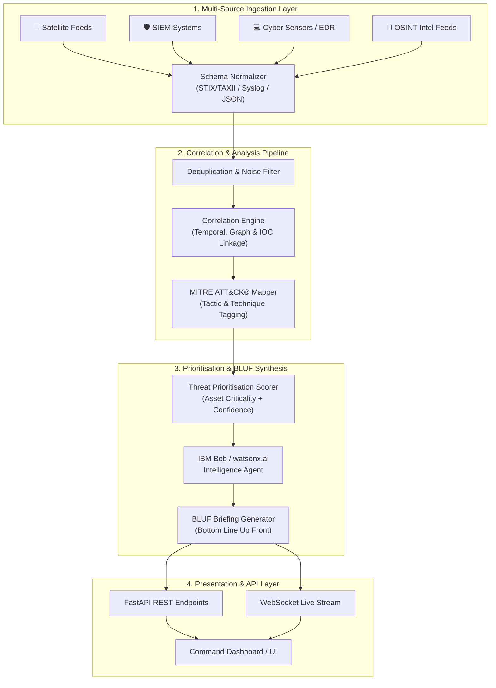

# 🛡️ Threat Intelligence Correlation & Alert Prioritisation Assistant — Backend Engine

> **Challenge D2:** Threat Intelligence Correlation & Alert Prioritisation Assistant  
> **Mission:** Ingest multi-source threat feeds, correlate cross-domain alerts to eliminate false positives, map attacker techniques to the MITRE ATT&CK® framework, and autonomously synthesize high-priority BLUF (Bottom Line Up Front) intelligence summaries for commanders and defence analysts.

---

## 👥 Team & Submission Information

| Field | Value |
|---|---|
| **Project Title** | Threat Intelligence Correlation & Alert Prioritisation Assistant (Backend) |
| **Track** | AI / Defence & Cybersecurity |
| **Challenge** | D2 — Critical Now: Threat Intelligence Correlation & Alert Prioritisation |
| **Branch** | `backend` |

---

## 🎯 Problem Statement

Defence operations centers and cybersecurity analysts face severe **alert fatigue**, receiving tens of thousands of fragmented alerts daily from diverse, disparate sources:
- **Enterprise SIEMs** (Splunk, QRadar, Elastic)
- **Satellite & Telemetry feeds** (orbital telemetry, RF signal intercepts, downlink anomaly logs)
- **Tactical Cyber Sensors** (network intrusion detection, endpoint telemetry, firewall feeds)
- **Intelligence Reports** (unstructured OSINT, threat bulletins, advisories)

**The Critical Pain Points:**
1. **Disparate Formats:** Feeds arrive in conflicting schemas (JSON, Syslog, STIX/TAXII, raw text).
2. **False Positive Overload:** Chasing noise wastes vital defense resources while genuine, coordinated zero-days and multi-vector intrusions get buried.
3. **Delayed Decision Cycles:** Commanders cannot decipher dense raw sensor logs; they need structured, high-confidence **BLUF (Bottom Line Up Front)** intelligence in minutes, not hours.

---

## 💡 Solution: The Backend Intelligence Engine

The **Backend Engine** is an asynchronous, AI-augmented threat intelligence pipeline built with **FastAPI** and **IBM Bob / watsonx.ai**. It automates the end-to-end ingestion-to-briefing lifecycle:

1. **Multi-Source Ingestion & Schema Normalization:** Standardizes multi-modal feeds into a unified Canonical Alert Schema.
2. **Intelligent Correlation & Noise Reduction:** Groups isolated alerts using temporal clustering, graph relationships, and IOC similarity to isolate real threat campaigns from false positives.
3. **Automated MITRE ATT&CK® Mapping:** Identifies threat actor Tactics, Techniques, and Procedures (TTPs) using pattern matching and semantic classification against the MITRE ATT&CK enterprise matrix.
4. **Autonomous BLUF Executive Synthesis:** Leverages generative AI (IBM Bob / watsonx Foundation Models) to synthesize military-grade **Bottom Line Up Front** summaries with tactical action recommendations.
5. **Dynamic Risk & Priority Scoring:** Calculates weighted risk scores based on asset criticality, threat confidence, and attack velocity to output a strictly ranked threat queue.

---

## 🏗️ Architecture & Data Flow



---

## ✨ Key Features

- **⚡ Asynchronous Multi-Stream Ingestion:** High-throughput streaming ingest for batched and real-time feeds with zero-drop queue handling.
- **🔍 Contextual Threat Correlation:** Links cyber indicators (IPs, hashes, domain names) with physical telemetry (satellite beacon anomalies, geographic sensors) into unified "Incidents".
- **🎯 Precision MITRE ATT&CK Matrix Mapping:** Automatically tags alerts with ATT&CK Technique IDs (e.g., `T1566: Phishing`, `T1190: Exploit Public-Facing Application`, `T1078: Valid Accounts`).
- **📝 Military-Grade BLUF Generation:** Produces concise executive assessments:
  - **Bottom Line (What is happening right now):** Direct operational impact.
  - **Identified Threat Actor / TTPs:** Attack signature and MITRE classification.
  - **Risk Rating & Urgency Level:** Critical / High / Medium / Low.
  - **Actionable Countermeasures:** Immediate mitigation steps for defense operators.
- **📊 Dynamic Risk Scoring Algorithm:**
  $$\text{Priority Score} = (\text{Threat Severity} \times 0.4) + (\text{Asset Criticality} \times 0.35) + (\text{Confidence} \times 0.25)$$
- **🔒 Secure & Auditable:** Role-based access control (RBAC) ready, structured logging, and full audit trails for threat provenance.

---

## 🛠️ Backend Tech Stack

| Component | Technology | Description |
|---|---|---|
| **Runtime & Language** | Python 3.11+ | High-performance asynchronous execution |
| **API Framework** | FastAPI + Uvicorn | Modern, OpenAPI-compliant async REST & WebSocket framework |
| **Data Validation** | Pydantic v2 | Strict canonical schema validation and serialization |
| **AI / LLM Orchestration** | IBM Bob / watsonx.ai SDK | Foundation models for reasoning, analysis, and BLUF synthesis |
| **Threat Framework** | MITRE ATT&CK® STIX 2.1 | Semantic mapping and technique extraction |
| **Correlation & Graph** | NetworkX / Scikit-learn | Graph-based IOC correlation and similarity clustering |
| **Database & Cache** | SQLite / PostgreSQL + Redis | Alert persistence and fast caching for deduplication |
| **Containerization** | Docker & Docker Compose | Cloud-native deployment and reproducible environments |

---

## 📁 Repository & Backend Structure

```
.
├── src/
│   ├── backend/
│   │   ├── app/
│   │   │   ├── api/
│   │   │   │   └── v1/
│   │   │   │       ├── endpoints/
│   │   │   │       │   ├── alerts.py        # Feed ingestion & query endpoints
│   │   │   │       │   ├── correlation.py   # Incident correlation & clustering
│   │   │   │       │   ├── mitre.py         # MITRE ATT&CK mapping endpoints
│   │   │   │       │   └── bluf.py          # BLUF report generation endpoints
│   │   │   │       └── router.py            # Central API route registration
│   │   │   ├── core/
│   │   │   │   ├── config.py                # Environment & application settings
│   │   │   │   └── security.py              # API key verification & headers
│   │   │   ├── models/
│   │   │   │   ├── alert.py                 # Raw and Canonical alert schemas
│   │   │   │   ├── incident.py              # Correlated incident data models
│   │   │   │   └── bluf.py                  # Structured BLUF summary schemas
│   │   │   ├── services/
│   │   │   │   ├── ingestion_service.py     # Parser & normalization pipeline
│   │   │   │   ├── correlation_engine.py    # Cross-source correlation & false positive filter
│   │   │   │   ├── mitre_mapper.py          # TTP extractor & MITRE matrix mapper
│   │   │   │   ├── prioritization.py        # Multi-factor alert scoring
│   │   │   │   └── bluf_generator.py        # IBM Bob / watsonx LLM prompt & synthesis engine
│   │   │   ├── data/
│   │   │   │   ├── mitre_attack.json        # Cached MITRE ATT&CK enterprise dataset
│   │   │   │   └── sample_feeds/            # Test datasets (SIEM, Satellite, Sensor logs)
│   │   │   └── main.py                      # FastAPI application entry point
│   │   ├── tests/
│   │   │   ├── test_ingestion.py            # Ingestion unit tests
│   │   │   ├── test_correlation.py          # Correlation logic tests
│   │   │   └── test_bluf.py                 # BLUF generation validation tests
│   │   ├── requirements.txt                 # Python dependencies
│   │   └── Dockerfile                       # Backend containerization
├── docs/                                    # Project documentation
├── presentation/                            # Project slide deck
├── demo/                                    # Demo recordings and screenshots
├── submission.yaml                          # Hackathon metadata
└── README.md                                # Root documentation (this file)
```

---

## ⚡ Quickstart & Setup Guide

### 1. Prerequisites
- **Python 3.11+** installed
- **Git** installed
- *(Optional)* **Docker & Docker Compose**

### 2. Clone the Repository & Switch to Backend Branch
```bash
git clone https://github.com/Abhi-1100/bob-ai-hackathon-Timon.git
cd bob-ai-hackathon-Timon
git checkout backend
```

### 3. Setup Virtual Environment
```bash
# Windows (PowerShell)
python -m venv venv
.\venv\Scripts\Activate.ps1

# Linux / macOS
python3 -m venv venv
source venv/bin/activate
```

### 4. Install Dependencies
```bash
cd src/backend
pip install --upgrade pip
pip install -r requirements.txt
```

### 5. Configure Environment Variables
Copy `.env.example` to `.env` inside `src/backend` (or root):
```bash
cp .env.example .env
```

Configure your secrets:
```ini
ENVIRONMENT=development
API_V1_STR=/api/v1
PROJECT_NAME="Threat Intelligence Correlation Assistant"

# IBM watsonx / Bob API Credentials
WATSONX_APIKEY=your_ibm_api_key_here
WATSONX_PROJECT_ID=your_watsonx_project_id_here
WATSONX_URL=https://us-south.ml.cloud.ibm.com
MODEL_ID=ibm/granite-13b-chat-v2

# Optional Redis / Database
REDIS_URL=redis://localhost:6379/0
```

### 6. Run the Backend API Server
```bash
uvicorn app.main:app --host 0.0.0.0 --port 8000 --reload
```

- **Interactive API Docs (Swagger UI):** [http://localhost:8000/docs](http://localhost:8000/docs)
- **Alternative API Docs (ReDoc):** [http://localhost:8000/redoc](http://localhost:8000/redoc)
- **Health Check:** [http://localhost:8000/health](http://localhost:8000/health)

---

## 🐳 Running with Docker

```bash
cd src/backend
docker build -t threat-intel-backend:latest .
docker run -p 8000:8000 --env-file .env threat-intel-backend:latest
```

---

## 🔌 API Specification & Core Endpoints

### 1. Ingest Multi-Source Threat Feed
`POST /api/v1/alerts/ingest`
Ingests raw or structured alerts from SIEM, satellite, sensors, or OSINT.
```json
{
  "source_type": "satellite_telemetry",
  "source_name": "SATCOM-LEO-04",
  "raw_payload": {
    "subsystem": "RF_UPLINK",
    "event": "Signal Jamming Detection",
    "frequency_band": "Ku",
    "snr_drop_db": 14.2,
    "source_ip": "198.51.100.44",
    "timestamp": "2026-09-13T10:15:00Z"
  }
}
```

### 2. Correlate Alerts & Filter Noise
`POST /api/v1/correlation/analyze`
Correlates disparate events into unified attack incidents and filters false positives.
```json
{
  "time_window_minutes": 60,
  "min_correlation_confidence": 0.75
}
```

### 3. MITRE ATT&CK Mapping
`POST /api/v1/mitre/map`
Analyzes IOCs and behavior to return mapped Tactics & Techniques.

### 4. Autonomous BLUF Synthesis
`POST /api/v1/bluf/generate/{incident_id}`
Generates the military-format BLUF assessment.

#### 📋 Example BLUF Output Response:
```json
{
  "incident_id": "INC-2026-0913-004",
  "priority": "CRITICAL",
  "confidence_score": 0.94,
  "bluf_briefing": {
    "bottom_line": "Active coordinated electronic-warfare and cyber penetration targeting SATCOM-LEO-04 downlink ground terminal. RF jamming coincided with unauthorized privilege escalation attempts from external IP 198.51.100.44.",
    "threat_actor_profile": "Activity matches known TTPs of APT28 / Sandworm targeting critical communication infrastructure.",
    "mitre_ttps": [
      {
        "tactic": "Initial Access",
        "technique_id": "T1190",
        "technique_name": "Exploit Public-Facing Application"
      },
      {
        "tactic": "Impact",
        "technique_id": "T1498",
        "technique_name": "Network Denial of Service (RF Jamming)"
      },
      {
        "tactic": "Defense Evasion",
        "technique_id": "T1078",
        "technique_name": "Valid Accounts"
      }
    ],
    "urgency": "IMMEDIATE ACTION REQUIRED",
    "recommended_actions": [
      "Isolate ground station gateway IP 198.51.100.44 at perimeter firewall.",
      "Shift SATCOM-LEO-04 command downlink to secondary anti-jam channel Delta.",
      "Revoke compromised session tokens on Ground Station Host 02."
    ]
  }
}
```

---

## 🧪 Testing

Run backend unit and integration test suites:
```bash
pytest tests/ -v
```

---

## ⚠️ Known Limitations

- **Mock Feeds for Classified Formats:** Classified military satellite sensor feeds are simulated using realistic synthetic telemetry conforming to standard RF/MIL-STD schemas.
- **Offline Mode:** LLM BLUF synthesis requires active connectivity to IBM watsonx / Bob API endpoints, with a rule-based fallback generator provided for air-gapped simulations.

---

## 🏅 Highlights & Technical Excellence

1. **True Cross-Domain Correlation:** Breaks down silos between space/RF telemetry, network SIEM, and endpoint sensor feeds.
2. **Actionable Commander Briefings:** Translates thousands of obscure logs into an executive BLUF format within seconds.
3. **Deterministic MITRE Mapping:** Rigorous STIX-grounded TTP identification paired with generative reasoning.
