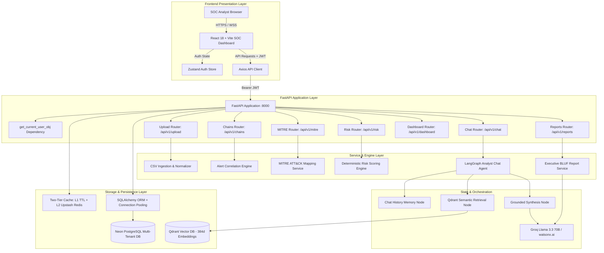

# Architecture: Sentinel Forge

## System Architecture

Sentinel Forge is architected as a decoupled, multi-tenant cloud-native application featuring an asynchronous FastAPI Python backend, a high-performance React (Vite) single-page frontend, a Neon PostgreSQL relational database, an Upstash Redis two-tier caching layer, a Qdrant vector database, and LangGraph-orchestrated LLM intelligence agents.

---

## Components

| Component | Technology | Responsibility |
| :--- | :--- | :--- |
| **Frontend UI** | React 18, Vite, Lucide Icons, Recharts, Framer Motion | Provides responsive SOC analyst dashboard, real-time metrics, interactive MITRE matrix, attack chain inspection, PDF/Markdown report export, and AI chat dialog. |
| **Backend REST API** | FastAPI, Uvicorn, Pydantic v2 | Exposes authenticated REST endpoints, enforces request validation, manages session lifecycles, and executes background ingestion and correlation tasks. |
| **Relational Database** | PostgreSQL (Neon Cloud / Local) | Stores operational records across isolated schemas: `users`, `uploads`, `alerts`, `attack_chains`, `mitre_mappings`, `risk_scores`, `recommendations`, `reports`, `chat_history`. |
| **Vector Database** | Qdrant Cloud / FastEmbed | Houses dense vector embeddings of correlated attack chains and threat context for sub-millisecond semantic retrieval in analyst RAG workflows. |
| **Caching Layer** | Upstash Redis (REST) + L1 Local In-Memory Cache | Caches computed dashboard statistics, attack chain queries, and MITRE distributions with tenant-scoped keys (`prefix_{user_id}`) to eliminate repetitive database queries. |
| **AI Orchestration** | LangGraph & LangChain | Manages stateful agent execution graphs, multi-turn conversational context, and conditional node transitions. |
| **Inference Engine** | Groq Cloud (Llama 3.3 70B Versatile) / watsonx.ai | High-throughput LLM inference for executive BLUF reports, containment recommendations, and threat analyst query answering. |

---

## Data Flow & Pipeline Execution

1. **Telemetry Ingestion**: The analyst uploads a raw alert CSV file. The CSV parser streams records, validates headers (`timestamp`, `src_ip`, `dst_ip`, `event`, `severity`), trims whitespace, normalizes severity representations, and bulk-inserts rows tagged with the operator's `user_id`.
2. **Temporal Correlation**: The correlation engine filters unassigned alerts for that `user_id`, groups alerts sharing common source IPs, and partitions events into distinct Attack Chains whenever event gaps exceed the 30-minute correlation threshold.
3. **MITRE Tactical Mapping**: Attack chain event sequences are mapped against the 14 MITRE ATT&CK enterprise tactics and specific technique IDs (e.g., Reconnaissance -> T1046 Network Service Scanning; Credential Access -> T1110 Brute Force).
4. **Deterministic Risk Calculation**: The risk scoring engine evaluates:
   $$\text{Score} = \min(100, \text{EventScore} + \text{MitreScore} + \text{ChainBonus})$$
   Calculated scores and severity levels (`Critical`, `High`, `Medium`, `Low`) are persisted and cached.
5. **Vector Index Synchronization**: Summarized attack chain narratives and risk scores are embedded via FastEmbed and synced to Qdrant vector collections.
6. **Analyst Conversational RAG**: When an analyst asks a question in the chat interface, the LangGraph workflow retrieves previous dialogue memory, conducts semantic vector search in Qdrant, synthesizes a grounded answer with cited IOCs, and stores the conversational turn.

---

## Multi-Tenant Security & Isolation Architecture

- **Tenant Scoping at Model Level**: All core tables (`uploads`, `alerts`, `attack_chains`, `chat_history`) maintain a foreign key `user_id` linked with cascading deletion to `users.id`.
- **Composite Indexing**: Attack chains utilize a composite unique index on `(user_id, chain_id)`, allowing multiple independent tenants to maintain clean sequences (`AC001`, `AC002`, ...) without collisions.
- **Strict Query Filtering**: SQLAlchemy repository queries explicitly mandate `.filter(Model.user_id == current_user.id)`, mathematically preventing cross-tenant leakage.
- **Tenant-Prefixed Cache Keys**: Cache keys are structured as `{endpoint_name}_{user_id}` (e.g., `dashboard_stats_9b1deb4d-...`), eliminating cross-tenant cache bleeding.
- **JWT Authentication**: High-entropy signed JSON Web Tokens (HS256) enforce user identity verification on all private routes with configurable expiration and bcrypt password hashing.
- **CORS Protection**: CORS middleware handles preflight and cross-origin security between the deployed Vercel frontend and Render backend.
